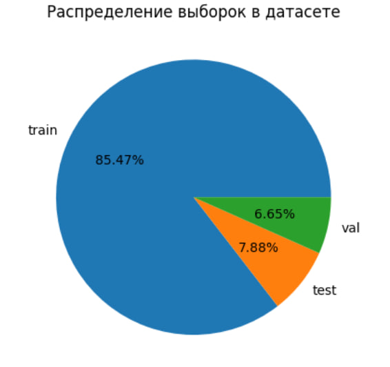
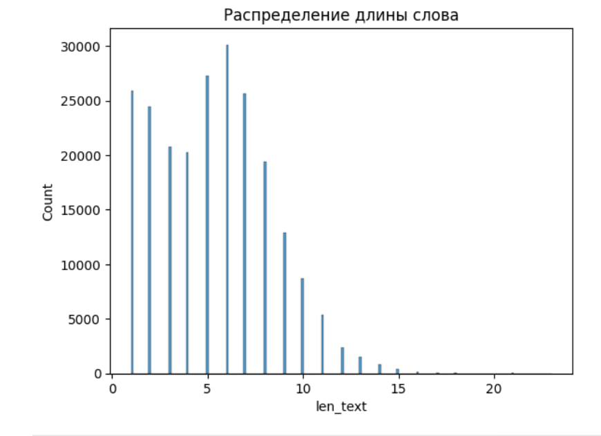
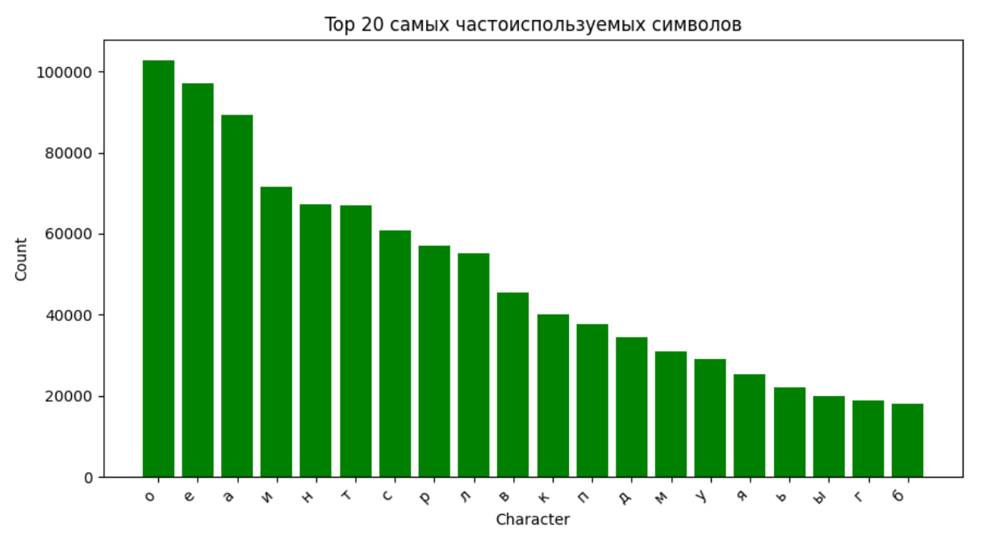
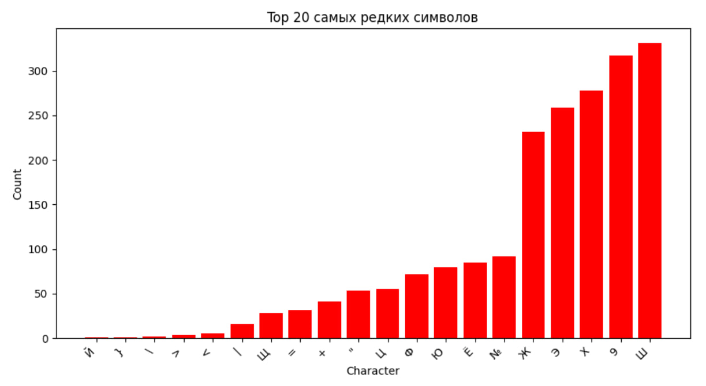
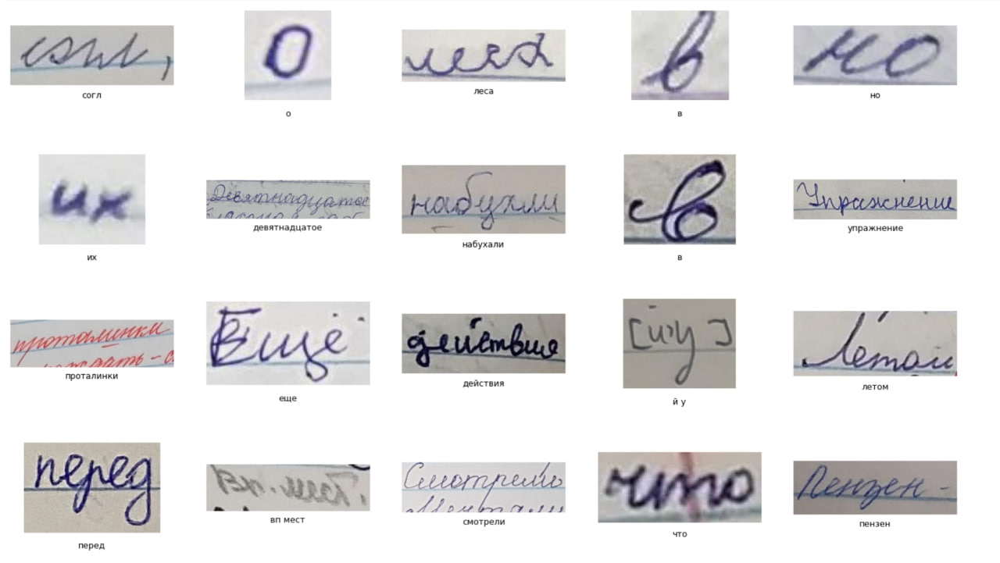
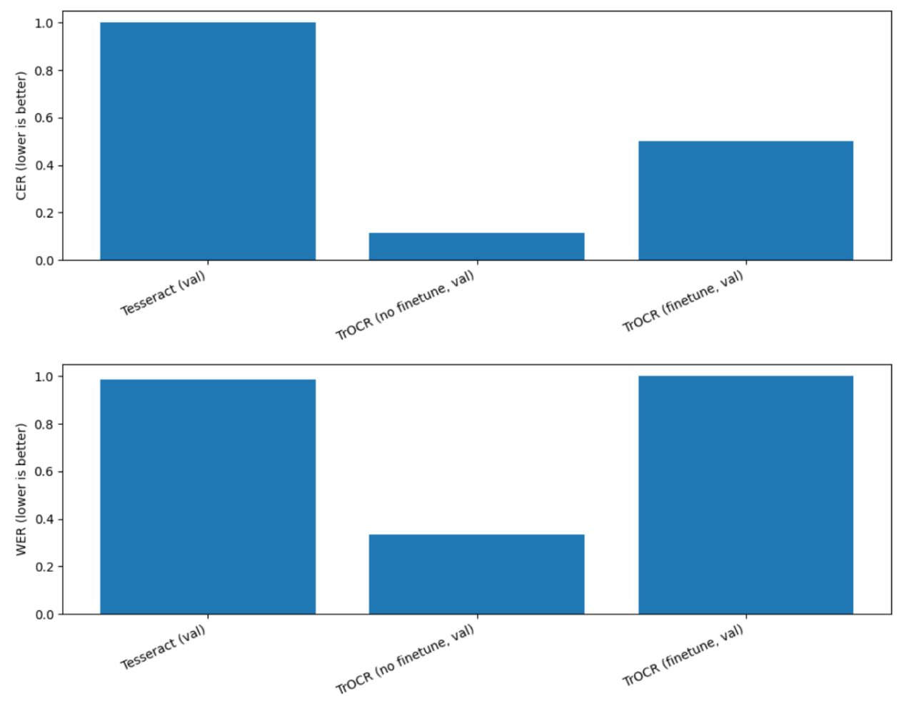
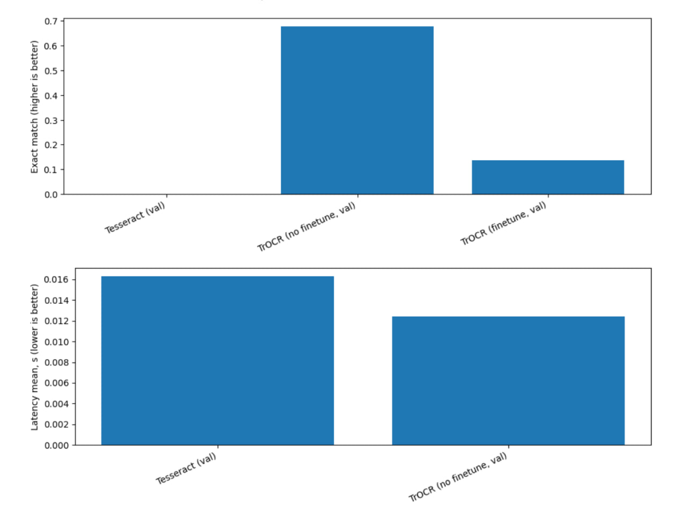

## Предобработка данных

+ Были удалены латинские символы
+ Заменил ё на e


## Анализ датасета



**Как видно из графика в нашем датасете около 85% примеров было для тренировки**



**Очень много слов было состоящих из одного символа. Средняя длина слова составляла порядка 6 символов**




**Самые популярные символы в датасете -  о, e, a, и, н**



**Самые редкие символы в датасете -  цифры, "ъ", "э"**



**Как видно достаточно в данных присутствуют изображения, на которых слова перечеркнуты, неаакуратный подчерк, а также низкое качество изображений**

## Результаты





**Выводы** :

+ Tesseract на рукописном датасете работает плохо: CER ≈ 1.03, WER ≈ 0.99, Exact match ≈ 0. То есть модель почти никогда не угадывает слово полностью и сильно ошибается по символам/словам.

+ TrOCR без fine-tuning показывает лучший результат и является текущим бенчмарком:

+ CER ≈ 0.11 (в разы лучше Tesseract),

+ WER ≈ 0.33,

+ Exact match ≈ 0.68 (примерно 2/3 слов распознаются полностью правильно).

+ Fine-tuning TrOCR в текущей постановке ухудшил качество:
CER вырос до ≈ 0.50,WER вырос до ≈ 1.27,Exact match упал до ≈ 0.14.Это означает, что дообучение привело к деградации и модель стала предсказывать существенно хуже, чем исходная.

+ По скорости: TrOCR (no finetune) по средней latency сопоставим или немного лучше Tesseract; существенного штрафа по времени на инференс не видно.

+ Для интеграции в UI разумно брать TrOCR (no finetune), а fine-tuning в текущем виде фиксируем как неуспешный.

## Инференс

1) Инициализация

Загружает TrOCRProcessor и VisionEncoderDecoderModel с Hugging Face по MODEL_ID = "kazars24/trocr-base-handwritten-ru".

2) Выбирает устройство cuda (если доступно) иначе cpu.

Переводит модель в режим eval().

3) Приём изображения

Получает файл (фото/скан), читает байты, открывает через PIL.Image и приводит к RGB.

4) Препроцессинг изображения

Нормализует/масштабирует изображение,приводит к нужному размеру/формату,формирует тензор pixel_values.

5) Генерация текста (инференс)

+ max_new_tokens ограничивает длину ответа,

+ num_beams управляет качеством/скоростью (1 = быстро).


6) декодирование результата
```processor.batch_decode(gen_ids, skip_special_tokens=True) ``` превращает токены модели в строку.


7) Возврат результата

Для API/UI возвращает JSON вроде: 
``` {"text": "...", "model_id": "...", "device": "cuda"}.```

**Важно:** модель не “понимает документ целиком” автоматически. Если пользователь сфоткает страницу тетради, качество будет зависеть от того, что подано на вход.Лучший сценарий — предварительно вырезать (crop) область со словом/строкой (как в датасете с bbox). Если подать “всю страницу” целиком, модель может распознавать хуже из-за масштаба/фона/многих строк.